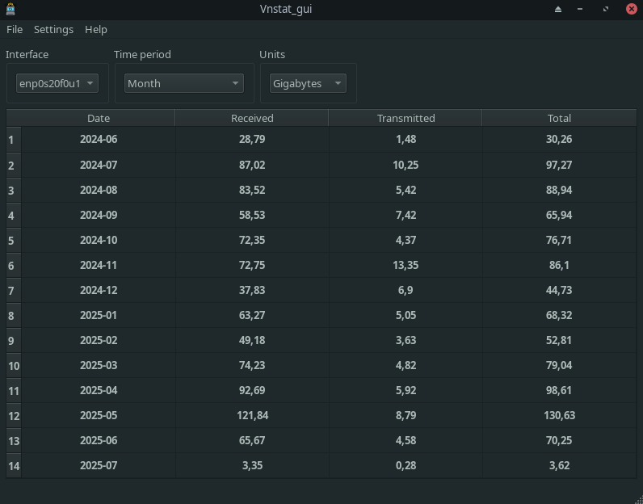

About Vnstat_gui application
========================

Screenshots
===========

Description
===========

It's a simple program that showing network statistics.
The data loading from vnstat database file 
that must be located at /var/lib/vnstat/vnstat.db.
Therefore you must install vnstat application
before starting to use Vnstat_gui.

Copyright (C) 2025  Teg Miles.
Process monitor is free software: you can redistribute it and/or modify it
under the terms of the GNU General Public License as published by
the Free Software Foundation, either version 3 of the License,
or any later version.

Features
========

  * Show installed network interfaces (Wi-Fi adapters, Ethernet connections etc).
  * Show selected time periods.
  * Show units of measurment of uploaded/downloaded amount of a data.
  * Show a table with proper traffic statistics.

Authors
========

  - Teg Miles (movarocks2@gmail.com)
  - The logo icon was taken from https://www.flaticon.com/free-icon/setting_7415329 Eucalyp - Flaticon.

Requirements
============

* Qt6 (6.6.1 or newer), CMake (3.16 or newer), 
  C++ compiler (GCC, Clang or MSVC), vnstat.

Following operating systems:

* **Linux**: x86_64 with kernel 6.14.0 or higher.  *Manjaro 23.0.0 (or newer) recommended.*

Configuration
=============

Configuration for the application is stored in the ``Vnstat_gui.conf`` file or registry item
in a directory appropriate to your OS.  

Refer to this table:

System     Directory
====================
Linux, BSD ``$XDG_HOME/`` if defined, else ``~/.config/``
